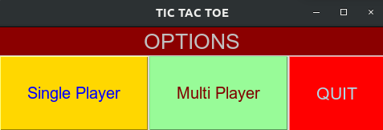
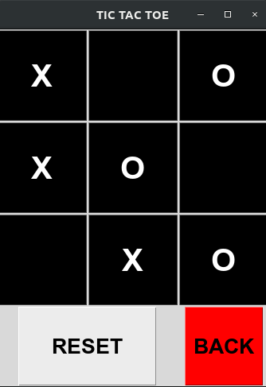
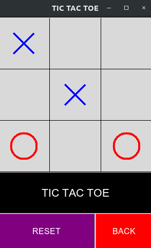
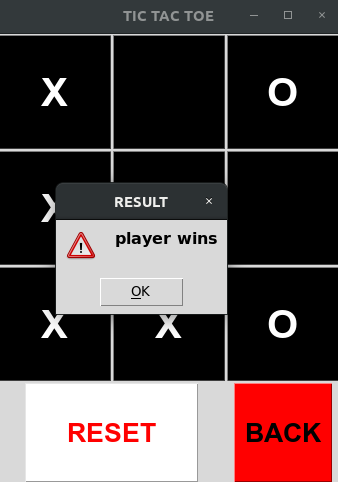
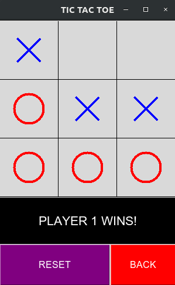

# Tic-Tac-Toe
A GUI based implementation of tic-tac-toe using Tkinter. This has options for playing single user(against computer) or multi-user. 

# GUI

#### Start

#### Playing Area
 &nbsp; &nbsp; &nbsp; &nbsp; &nbsp; &nbsp; &nbsp; &nbsp; &nbsp; 

#### Result
 &nbsp; &nbsp; &nbsp; &nbsp; &nbsp; &nbsp; &nbsp; &nbsp; &nbsp; 

# To-Do:
1. Store user data to keep stats of users.
2. Make single player more intelligent.
3. Increase the size of the board.
4. Allow interactions between two different systems to play multi-user accros systems using internet.
